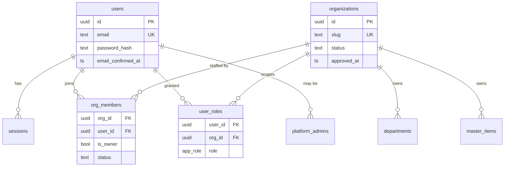
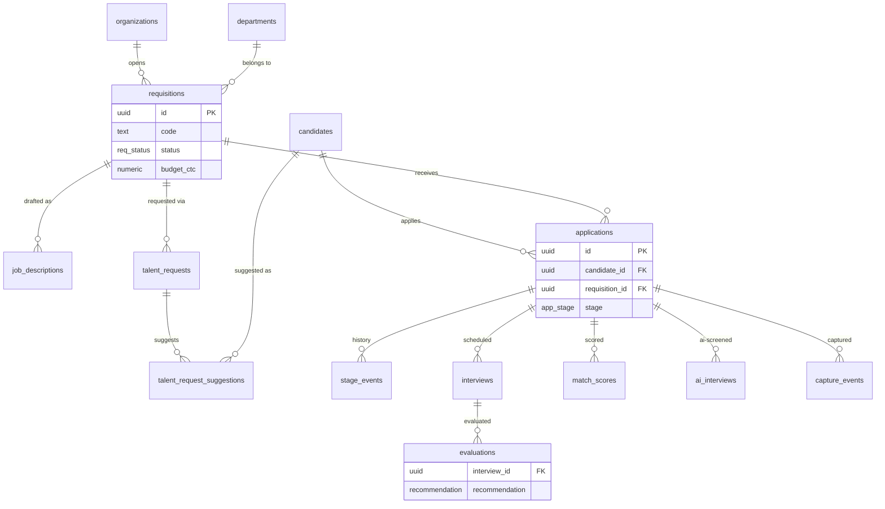
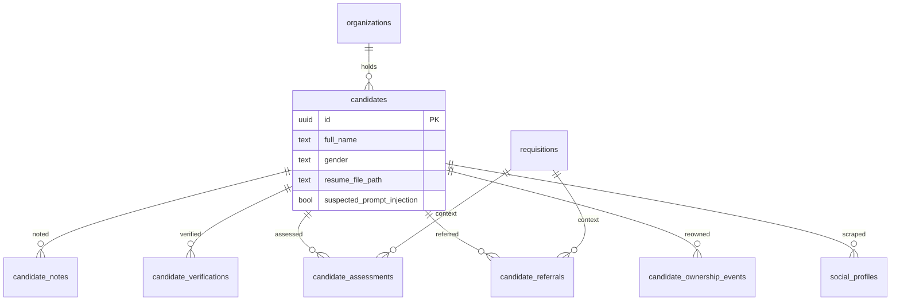
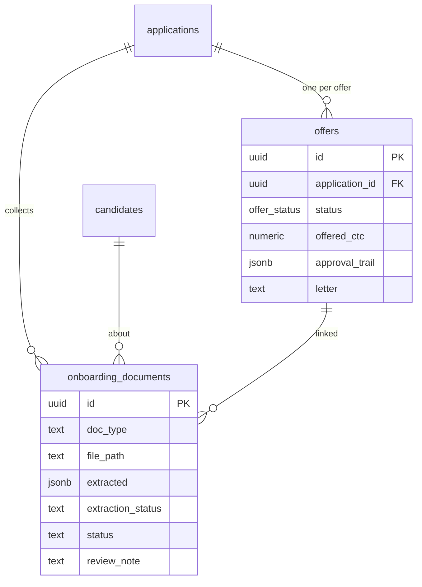
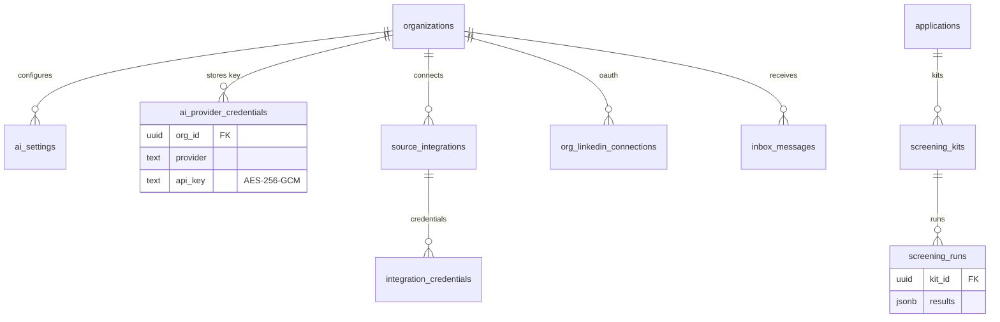
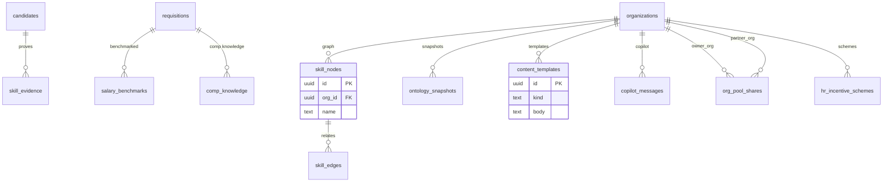

# ATSIQ Backend — Schema, Data Flow, Rules & Security Reference

_Audited 2026-09-25 against `drizzle/schema.ts` and the running Postgres 14 database. For the backend team._

## 1. Overview

|              |                                                                                                                                                                                                                                                                       |
| ------------ | --------------------------------------------------------------------------------------------------------------------------------------------------------------------------------------------------------------------------------------------------------------------- |
| Database     | **Postgres 14**, plain SQL (no extensions beyond `pgcrypto`)                                                                                                                                                                                                          |
| Access layer | **drizzle-orm** (`postgres-js` driver), single pooled handle in `src/server/db.ts` (`max: 10`, 12 s statement timeout)                                                                                                                                                |
| Table count  | **48** base tables (plus 7 Postgres enums)                                                                                                                                                                                                                            |
| Migrations   | `drizzle/pg-migrations/00*.sql`, applied in order by `scripts/migrate-pg.mjs` — vanilla-Postgres safe                                                                                                                                                                 |
| Supabase     | **None at runtime.** No RLS, no `auth` schema, no PostgREST, no Supabase Storage. Only type definitions (`src/integrations/supabase/types.ts`) and a naming shim (`requireSupabaseAuth` = re-export of the internal `requireIdentity`) survive from the migration era |

**Audience note:** every query in the app goes through server functions (`src/lib/*.functions.ts`, `src/server/*.ts`); the browser never talks to the database directly.

---

## 2. Security model (applies to every table)

There is **no row-level security** — authorization is enforced in application code, uniformly:

1. **Authentication** — first-party. `users.password_hash` (scrypt `scrypt$N$r$p$salt$hash`), `sessions` table, httpOnly `atsiq_session` cookie. `/api/auth/*` endpoints. Every request resolves via `requireIdentity` (`src/lib/auth.middleware.ts`).
2. **Tenancy** — `requireOrg` resolves the caller's **active org** from `org_members` (status `active`) and exposes `context.orgId` / `context.userId` / `context.memberEmail`. **42 of 48 tables carry `org_id`** and every query predicates on it explicitly — cross-tenant reads fail by returning nothing. The 6 without `org_id` are: `organizations` (the tenant itself), `users`, `sessions`, `platform_admins` (identity/platform plane), `org_pool_shares` (uses `owner_org`/`partner_org` instead), `product_catalogue_commercials` (global catalogue).
3. **Roles** — `app_role` enum: `recruiter → hiring_manager → department_head → hr_head → president_cbo`. `assertRole(userId, orgId, roles)` enforces per action; an **org owner** (`org_members.is_owner`) passes every role. Platform-wide powers live in `platform_admins`.
4. **Secrets** — long-lived credentials (`ai_provider_credentials`, `integration_credentials`) are AES-256-GCM encrypted (`enc:v1.<iv>.<ct>.<tag>`, key = `SECRET_ENCRYPTION_KEY`, `src/server/crypto.ts`). Never returned to clients — only `hasProviderKey` booleans.
5. **Audit** — sensitive mutations write to `audit_log` (actor, action, entity, JSON detail) via `src/server/audit.ts`.
6. **Files** — binary content never lives in tables. Private objects in `src/server/storage.ts` (S3/MinIO; `.local-storage/` fallback in dev) under **org-prefixed paths** (`<org_id>/…`); reads verify the path prefix belongs to the caller's org.
7. **Lifecycle integrity** — stage machines are Postgres enums (`app_stage`, `offer_status`, `req_status`, `jd_status`) plus server-side transition rules (`OFFER_TRANSITIONS`, `FLOW`), so invalid transitions throw rather than corrupt state.

---

## 3. Table catalog by domain

Legend: **org** = has `org_id` tenant column. “Writers” = server modules that mutate the table.

### 3.1 Identity & tenancy (9)

| Table             | Purpose                               | Key columns                                                                              | org               | Writers                              | Security notes                                                              |
| ----------------- | ------------------------------------- | ---------------------------------------------------------------------------------------- | ----------------- | ------------------------------------ | --------------------------------------------------------------------------- |
| `users`           | First-party accounts                  | `email` (unique), `password_hash`, `email_confirmed_at`, `last_login_at`                 | –                 | `identity.ts`, register/confirm APIs | scrypt hashes; legacy bcrypt still verifies; never exposed to other tenants |
| `sessions`        | Cookie sessions                       | `user_id →users`, token, expiry                                                          | –                 | `identity.ts`                        | httpOnly cookie; invalidated on sign-out/password change                    |
| `organizations`   | Tenants                               | `slug` (unique), `status`, `approved_at`, `inbox_slug`, `onboarding_step`                | – (is the tenant) | `org.functions.ts`, platform console | creation gated by platform approval flow                                    |
| `org_members`     | Membership                            | `org_id →organizations`, `user_id →users`, `email`, `is_owner`, `status`, `invited_role` | ✅                | `org.functions.ts`                   | unique (org, user)/(org, email); `is_owner` is the super-role               |
| `user_roles`      | Explicit role grants                  | `user_id →users`, `org_id`, `role app_role`                                              | ✅                | `org.functions.ts`                   | checked by `assertRole`                                                     |
| `platform_admins` | Platform super-users                  | `user_id`, `email`                                                                       | –                 | platform console                     | cross-tenant console access                                                 |
| `departments`     | Org departments                       | `name`, `head metadata`                                                                  | ✅                | `org.functions.ts`                   | –                                                                           |
| `master_items`    | Org master data (locations, sources…) | `kind`, `name`, `org_id`                                                                 | ✅                | `master.functions.ts`                | unique (org, kind, name) — was global, fixed by `0034`                      |
| `audit_log`       | Append-only audit                     | `actor`, `actor_user_id`, `action`, `entity_type/id`, `detail jsonb`, `ip`               | ✅                | `src/server/audit.ts`                | written on auth, AI settings, offers, documents, candidate edits            |

### 3.2 Requisitions & job descriptions (4)

| Table                        | Purpose                             | Key columns                                                                         | org | Writers                                                             | Security notes                                                   |
| ---------------------------- | ----------------------------------- | ----------------------------------------------------------------------------------- | --- | ------------------------------------------------------------------- | ---------------------------------------------------------------- |
| `requisitions`               | Open roles                          | `code`, `title`, `status req_status`, `budget_ctc`, weights, `approval_trail jsonb` | ✅  | `requisitions.functions.ts`, `guards.ts` (`assertRequisitionInOrg`) | approval chain: draft→pending_dh→pending_hr→pending_cbo→approved |
| `job_descriptions`           | JD drafts per requisition           | `requisition_id →requisitions`, `full_text`, `status jd_status`                     | ✅  | `requisitions.functions.ts`                                         | AI-drafted (org's own key)                                       |
| `talent_requests`            | Manager hiring requests             | `requisition_id`, rationale, urgency                                                | ✅  | `collaboration.functions.ts`                                        | hiring-manager intake into pipeline                              |
| `talent_request_suggestions` | AI-suggested candidates per request | `request_id →talent_requests`, `candidate_id →candidates`                           | ✅  | `collaboration.functions.ts`                                        | explainable suggestion payload                                   |

### 3.3 Candidates (7)

| Table                        | Purpose                           | Key columns                                                                                                   | org | Writers                                                   | Security notes                                                                               |
| ---------------------------- | --------------------------------- | ------------------------------------------------------------------------------------------------------------- | --- | --------------------------------------------------------- | -------------------------------------------------------------------------------------------- |
| `candidates`                 | Talent-pool records               | `full_name`, `email`, `gender`, skills[], `resume_text`, `resume_file_path`, CTCs, `employment_history jsonb` | ✅  | `candidates.functions.ts`, `intake.server.ts`, apply flow | PII: org-scoped; CV stored privately (`resume_file_path`); `suspected_prompt_injection` flag |
| `candidate_notes`            | Recruiter notes                   | `candidate_id`, body                                                                                          | ✅  | `collaboration.functions.ts`                              | –                                                                                            |
| `candidate_verifications`    | Document/social verification runs | `candidate_id`, verdict                                                                                       | ✅  | `verification.functions.ts`                               | –                                                                                            |
| `candidate_assessments`      | Structured assessments            | `candidate_id`, `requisition_id`, answers                                                                     | ✅  | `assessment.functions.ts`                                 | –                                                                                            |
| `candidate_referrals`        | Referral intake                   | `candidate_id`, `requisition_id`                                                                              | ✅  | intake/collaboration                                      | –                                                                                            |
| `candidate_ownership_events` | Ownership change history          | `candidate_id`, from/to owner                                                                                 | ✅  | `collaboration.functions.ts`                              | append-only trail                                                                            |
| `social_profiles`            | Scraped social evidence           | `candidate_id`, platform, scores                                                                              | ✅  | `matching.functions.ts`                                   | scored data kept org-side                                                                    |

### 3.4 Hiring pipeline (7)

| Table            | Purpose                                   | Key columns                                                                         | org | Writers                                                        | Security notes                                 |
| ---------------- | ----------------------------------------- | ----------------------------------------------------------------------------------- | --- | -------------------------------------------------------------- | ---------------------------------------------- |
| `applications`   | Candidate ↔ requisition, the pipeline row | `candidate_id`, `requisition_id`, `stage app_stage`, unique (req, cand)             | ✅  | `lifecycle.functions.ts`, `apply.functions.ts`, intake         | stage machine is an enum; moves recorded below |
| `stage_events`   | Stage history                             | `application_id`, from/to, reason                                                   | ✅  | `lifecycle.functions.ts`                                       | append-only                                    |
| `interviews`     | Scheduled/recorded interviews             | `application_id`, round, verdict                                                    | ✅  | `interviews.functions.ts`                                      | –                                              |
| `evaluations`    | Interview evaluations                     | `interview_id →interviews`, `application_id`, `recommendation` (select/reject/hold) | ✅  | `interviews.functions.ts`                                      | select on final round unlocks offer stage      |
| `ai_interviews`  | AI screening interviews                   | `application_id`, `jd_match_score`, `skillset_score`, `transcript jsonb`            | ✅  | `matching.functions.ts` (`runAiScreening` → `saveAiInterview`) | runs on the org's own AI key                   |
| `match_scores`   | JD↔CV explainable scores                  | `application_id`, `overall_score`, `rationale`                                      | ✅  | `matching.functions.ts`                                        | rationale is evidence text, never a bare rank  |
| `capture_events` | Sourcing capture events                   | `candidate_id`, `requisition_id`, payload                                           | ✅  | `capture.functions.ts`                                         | –                                              |

### 3.5 Offers & pre-onboarding (2)

| Table                  | Purpose                   | Key columns                                                                                                                                                                   | org | Writers                                              | Security notes                                                                                                                                                                                          |
| ---------------------- | ------------------------- | ----------------------------------------------------------------------------------------------------------------------------------------------------------------------------- | --- | ---------------------------------------------------- | ------------------------------------------------------------------------------------------------------------------------------------------------------------------------------------------------------- |
| `offers`               | Offer per application     | `application_id`, `offered_ctc`, `joining_date`, `status offer_status`, `approval_trail jsonb`, `letter`                                                                      | ✅  | `offers.functions.ts`                                | transition map enforced server-side; **release blocked until pre-onboarding readiness is green** (see §4.2); CBO approval forced when over budget                                                       |
| `onboarding_documents` | Candidate proof documents | `application_id`, `candidate_id`, `offer_id`, `doc_type`, `file_path`, `extracted jsonb`, `extraction_status/note`, `status` (pending/verified/rejected), `review_note/by/at` | ✅  | `onboarding.functions.ts`, careers inbox auto-filing | files stored privately; extraction (org's AI key) never auto-trusted — every row needs human validation; re-extract/refile resets validation; `review_note` mandatory on reject or on identity conflict |

### 3.6 Screening (2)

| Table            | Purpose                       | Key columns                                                   | org | Writers             | Security notes                |
| ---------------- | ----------------------------- | ------------------------------------------------------------- | --- | ------------------- | ----------------------------- |
| `screening_kits` | Question kits per application | `application_id`, `candidate_id`, `requisition_id`, questions | ✅  | screening functions | –                             |
| `screening_runs` | Kit runs & scores             | `kit_id →screening_kits`, results, audio refs                 | ✅  | screening functions | audio kept in private storage |

### 3.7 AI & integrations (6)

| Table                      | Purpose                       | Key columns                                                     | org | Writers                                               | Security notes                                        |
| -------------------------- | ----------------------------- | --------------------------------------------------------------- | --- | ----------------------------------------------------- | ----------------------------------------------------- |
| `ai_settings`              | Per-org model choice          | `provider` (openai/anthropic/google), `model`, last-test stamps | ✅  | `ai-settings.functions.ts` (`requireRole hr_head`)    | strict bring-your-own-key: no platform fallback       |
| `ai_provider_credentials`  | Encrypted API keys            | `org_id`, `provider`, `api_key` (enc)                           | ✅  | `ai-gateway.server.ts`                                | AES-256-GCM; only existence booleans leave the server |
| `source_integrations`      | Job-board/social integrations | provider, org                                                   | ✅  | `integrations.functions.ts`                           | –                                                     |
| `integration_credentials`  | Encrypted integration tokens  | `integration_id →source_integrations`, token (enc)              | ✅  | `integrations.server.ts`                              | encrypted as above                                    |
| `org_linkedin_connections` | LinkedIn OAuth state          | org, tokens                                                     | ✅  | `linkedin.functions.ts`, `collect.functions.ts`       | delegated OAuth; tokens encrypted                     |
| `inbox_messages`           | Careers-inbox mail            | org, from, attachments, parsed payload                          | ✅  | `local-inbox.*` (webhook + cron, shared-secret gated) | auto-files candidate docs at offer stage              |

### 3.8 Talent ontology (Talent Brain) (4)

| Table                | Purpose                    | Key columns                | org | Writers                           | Security notes                       |
| -------------------- | -------------------------- | -------------------------- | --- | --------------------------------- | ------------------------------------ |
| `skill_nodes`        | Org skill graph nodes      | `org_id`, name/aliases     | ✅  | `ontology.functions.ts` (raw SQL) | access gated by `requireBrainAccess` |
| `skill_edges`        | Graph relations            | node ↔ node, weight        | ✅  | `ontology.functions.ts`           | –                                    |
| `skill_evidence`     | Resume-derived skill proof | `candidate_id`, node, span | ✅  | ontology mining engine            | –                                    |
| `ontology_snapshots` | Graph versions             | `org_id`, snapshot jsonb   | ✅  | `ontology.functions.ts`           | –                                    |

### 3.9 Compensation & market (3)

| Table                  | Purpose                    | Key columns                   | org | Writers                         | Security notes |
| ---------------------- | -------------------------- | ----------------------------- | --- | ------------------------------- | -------------- |
| `salary_benchmarks`    | Market benchmark data      | `requisition_id`, percentiles | ✅  | `salary-benchmark.functions.ts` | –              |
| `comp_knowledge`       | Org compensation knowledge | `requisition_id`, entries     | ✅  | `comp-knowledge.*`              | –              |
| `hr_incentive_schemes` | Incentive plans            | plan jsonb                    | ✅  | `hr-performance.functions.ts`   | –              |

### 3.10 Content, collaboration & commerce (4)

| Table                           | Purpose                                 | Key columns                                             | org        | Writers                      | Security notes                                              |
| ------------------------------- | --------------------------------------- | ------------------------------------------------------- | ---------- | ---------------------------- | ----------------------------------------------------------- |
| `content_templates`             | Reusable templates (offer letters, JDs) | `org_id`, `kind` (incl. `offer_letter`), `source`, body | ✅         | `templates.functions.ts`     | offer letters rendered from these                           |
| `copilot_messages`              | Copilot chat history                    | `org_id`, thread, messages                              | ✅         | `copilot.functions.ts`       | –                                                           |
| `org_pool_shares`               | Talent-pool sharing between orgs        | `owner_org`, `partner_org`                              | (dual-org) | `collaboration.functions.ts` | explicit pairwise consent — the only cross-org read channel |
| `product_catalogue_commercials` | Global product catalogue                | plan/commercial fields                                  | – (global) | `catalogue.functions.ts`     | platform-managed                                            |

---

## 4. Core data flows

### 4.1 Hiring pipeline

```
requisitions (draft → approvals → approved)
  └─ applications (unique per candidate+requisition, stage app_stage)
       ├─ stage_events          (every move, append-only)
       ├─ job_descriptions       (AI-drafted per requisition)
       ├─ match_scores / ai_interviews   (explainable JD↔CV scoring, org AI key)
       ├─ interviews → evaluations       (select on final round ⇒ offer-ready)
       └─ offers (§4.2)
```

Stage progression is validated server-side; `stage_events` is the audit of record.

### 4.2 Offers & pre-onboarding (the release gate)

```
offer-ready application ──raise──▶ offers(status=draft, letter generated from content_templates)
  draft → pending_hr → pending_cbo → approved ──release──▶ released → accepted
                                     ▲
                                     │ server-side gate (offers.functions.ts):
                          readinessFor(org, application) must be ready:
        id_proof ✓ · experience_letter ✓ · payslips ✓ (3 distinct VERIFIED months,
        merged-PDF parts count) · education_certificate ✓
```

Pre-onboarding documents arrive by upload (dialog) or careers-inbox auto-filing → stored privately → extraction agent (org key) fills `extracted jsonb` → human validation (Validate/Reject; reject or any identity conflict requires a note) → identity cross-check vs candidate name/gender is server-enforced. Re-read/refile resets validation.

### 4.3 Identity & session

```
register → users(scrypt) + org_members(owner) → confirm email
login → sessions row + httpOnly cookie → every request: requireIdentity → requireOrg(context.orgId)
```

### 4.4 AI bring-your-own-key

```
Integrations page → ai_settings (provider/model) + ai_provider_credentials (encrypted)
Every AI call: resolveAiConfig(orgId) → org key only, else a clear "no key" failure. Never another tenant's key.
```

### 4.5 Careers inbox

```
candidate mail → /api/public/inbound-email (shared secret) → inbox_messages
 → attachment parse → auto-filed into onboarding_documents (offer-stage applications only)
```

---

## 5. ER diagrams

Mermaid `erDiagram` — split by domain; `org_id` edges to `organizations` are omitted for readability (every ✅ table has them).

### 5.1 Identity & tenancy



### 5.2 Requisitions & pipeline core



### 5.3 Candidates & their evidence



### 5.4 Offers & pre-onboarding



### 5.5 AI, screening & integrations



### 5.6 Talent brain, comp & content



---

## 6. Supabase independence (audit conclusion, 2026-09-25)

- 48/48 tables are plain Postgres; 14/14 migrations apply to a vanilla cluster
- All DB access funnels through drizzle (`src/server/db.ts`); no PostgREST idioms, no `auth.uid()`, no RLS anywhere
- Remaining `supabase` mentions are non-runtime: `types.ts` (type-only), the `requireSupabaseAuth` naming shim, two dead unimported client files, and comments
- Empirically proven: the full offers + pre-onboarding e2e suite (62 browser checks) runs green against a bare local Postgres with no Supabase present

**Verification commands**

```bash
psql "$DATABASE_URL" -c "select count(*) from information_schema.tables where table_schema='public'"   # 48
grep -rn "@supabase/supabase-js" src/    # only the 2 dead files in integrations/supabase/
bunx tsc --noEmit                        # clean
```
